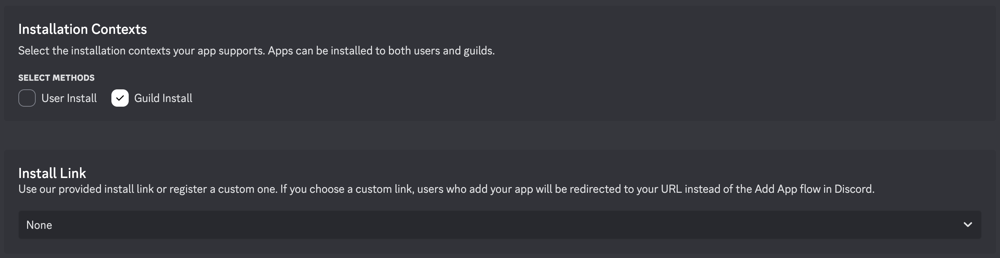

# Self‐Hosting a Discord Bot on a VPS

This guide provides a step-by-step process to self-host the CrossBan Discord bot on a [Virtual Private Server (VPS)](#user-content-fn-1)[^1]. CrossBan is a bot for synchronizing bans across multiple Discord servers, built with TypeScript, Discord.js, and PostgreSQL. It's containerized with Docker for easy deployment.


This bot is licensed under the PolyForm Noncommercial License 1.0.0.\
You may not use it for commercial purposes or to make money.\
Self-hosting is for personal or non-profit use only.


## Prerequisites

### Minimum VPS Requirements

* **OS**: Ubuntu 22.04 LTS or similar Linux distribution (recommended for Docker compatibility).
* **RAM**: At least 2GB because Docker is known for eating RAM for breakfast.
* **Storage**: 10GB+ free space (for Docker images, database, and logs). 20GB+ is better.
* **CPU**: 2 cores (sufficient for moderate usage).


A server costs money - you shouldn't use free hosting solutions, because you don't get a personal IP address which can lead to problems with your bot.

Usually servers with those requirements cost around 3-5€ / month, depending on the hosting provider.

A server doesn't cost that much and I would recommend Venocix - a very reliable hosting solution from Germany.

<a href="https://venocix.de/cart.php?a=add&#x26;pid=92" class="button primary">Server suggestion</a>


### Software Requirements

#### **Server Requirements**

* **Docker**: Version 27+ (use the newest version so you don't have to update it for a longer time)
* **Docker Compose**: Version 2.39 (same thinking as above)
* **Git**: For cloning the repository.
* **SSH Access**: To your VPS for remote management.

#### **Local Requirements**

* An SSH client like [Termius](https://termius.com/) to safely connect to your VPS and have an easy to use user interface.

#### Other Requirements

* A Discord bot token (create one at the [Discord Developer Portal](https://discord.com/developers/applications)). More to that later on.

***

## Set up the Bot

### Step 1: Prepare Your VPS

1. **Connect to Your VPS** with your SSH client.
2.  **Update the System**:

    ```bash
    sudo apt update && sudo apt upgrade
    ```

    _Remember that you don't see the password you type in for safety reasons._
3. **Install Docker and Docker Compose**: Please refer to the offical [Docker Docs](https://docs.docker.com/engine/install/) for the correct installation method for your OS.
4.  **Install Git**:

    ```bash
    sudo apt install git
    ```
5.  **Verify Installations**:

    ```bash
    docker --version
    docker compose version
    git --version
    ```


### Step 2: Clone and Set Up the Repository

1.  **Clone the Repository**:

    ```bash
    git clone https://github.com/The-LukeZ/CrossBan.git
    cd CrossBan
    ```


2. **Create Environment File**:
   *   Copy the example environment file:

       ```bash
       cp .env.example .env
       ```


   *   Edit `.env` with your details:

       ```bash
       nano .env # opens a simple file editor
       ```

       Fill in the placeholders.


### **Step 3: Invite the Bot to Your Servers**

1. Go to the Discord Developer Portal.
2.  Disable the General **Install Link** and only allow **Guild Install**.\


    <div align="center"><figure><figcaption></figcaption></figure></div>


3.  Go to the Bot page and disable The Public bot and Regenerate your Bot's Token.\


    <figure><figcaption><p>Disable Public bot because otherwise anyone will invite your bot - you don't want that.</p></figcaption></figure>
4. Under your bot application, go to **OAuth2** > **OAuth2 URL Generator**.
5. Select scopes: `bot`, `applications.commands`.
6. Select permissions: **Ban Members**, **View Audit Log**, **Send Messages**, **Use Slash Commands**.
7. Use the generated URL to invite the bot to your servers.


### Step 4: Configure and Run the Bot

1. **Build and Start the Bot**:
   *   Use the Docker Compose file:

       ```bash
       pnpm run docker:build
       ```
   * This builds the [Docker images](#user-content-fn-2)[^2], starts the bot and PostgreSQL database, and runs them in detached mode (so they run in the background, even when you disconnect from the server).\

2. **Verify the Setup**:
   *   Check container status:

       ```bash
       docker compose ps
       ```
   *   View logs:

       ```bash
       docker compose logs -f
       ```
   * The bot should appear online in your Discord servers. Run `/config` in Discord to configure settings.\

3. **Initial Configuration in Discord**:
   * Use slash commands like `/config sources-of-truth` to set trusted users.
   * Configure ban sync settings per server.


### Step 4: Monitoring and Maintenance

#### Logs

*   View real-time logs:

    ```bash
    docker compose logs
    ```

#### Updates

*   Pull the latest code:

    ```bash
    # Go into directory where the code is located
    cd CrossBan
    # Pull the latest code
    git pull origin main
    ```
*   Restart:

    ```bash
    pnpm run docker:restart
    ```

<details>

<summary>Developer Note</summary>

Yes, it would be better to also rebuild the image, but as long as that doesn't change, it works with just restarting the bot. Additional documentation will be added when that needs to be done.

</details>

#### Backups

*   Backup the database volume:

    ```bash
    docker compose exec postgres pg_dump -U {POSTGRES_USER} {POSTGRES_DB} > backup.sql
    ```

    <mark style="color:red;">**Remember to put in the values you have in your**</mark><mark style="color:red;">**&#x20;**</mark><mark style="color:red;">**`.env`**</mark><mark style="color:red;">**&#x20;**</mark><mark style="color:red;">**file!**</mark>
* Store `backup.sql` securely (e.g., off-VPS).

#### Stopping the Bot

```
pnpm run docker:down
```

#### Restarting

```
pnpm run docker:restart
```

***

## Troubleshooting

#### Common Issues

* **Bot Not Starting**: Check `.env` for errors. Ensure `BOT_TOKEN` is valid and permissions are correct.
* **Database Connection Failed**: Verify `DATABASE_URL` and that PostgreSQL is running (`docker compose ps`).
* **Permissions Errors**: Ensure the bot has `Ban Members` and `View Audit Log` in all servers.
* **Container Crashes**: Use `docker compose logs` to diagnose. Common causes: invalid env vars or port conflicts. If a container is stuck in a restart-loop (containers restart themselves if they fail) stop the containers with `pnpm run docker:down` and open a Github Issue so we can resolve this together.

#### Database Issues

*   If PostgreSQL fails to start, delete the volume and restart:

    ```bash
    docker compose down -v
    docker compose up -d --build
    ```


This deletes all data; use only if necessary.


#### Performance

* For high-traffic servers, increase VPS resources.

## Security Considerations

* **Environment Variables**: Never commit `.env` to Git (This is ensured by default with the `.gitignore` file).
* **Updates**: Keep Docker and the system updated to patch vulnerabilities.
* **Access**: Limit SSH access with key-based authentication. (For advanced users)

## Additional Resources

* [Discord.js Documentation](https://discord.js.org/docs/packages/discord.js)
* [Docker Compose Docs](https://docs.docker.com/compose/)
* [PostgreSQL Docs](https://www.postgresql.org/docs/)
* The Repository: [CrossBan on GitHub](https://github.com/The-LukeZ/CrossBan)

If you encounter issues, check the [repository's issues](https://github.com/The-LukeZ/CrossBan/issues) or logs for more details. Happy hosting!

[^1]: A "VPS" is a virtual server. A VPS is like renting an apartment in a big building. You share the physical server with others, but you get your own private space with dedicated resources, unlike shared hosting.\
    It's like you get guaranteed space, electricity, and privacy, while other tenants (other VPS users) live in the same building and share the infrastructure, but your apartment is separate, so you can set it up however you like.

[^2]: A docker image is like a blueprint, for building a house.\
    The built house can then be used. A built docker container is like a built house.
